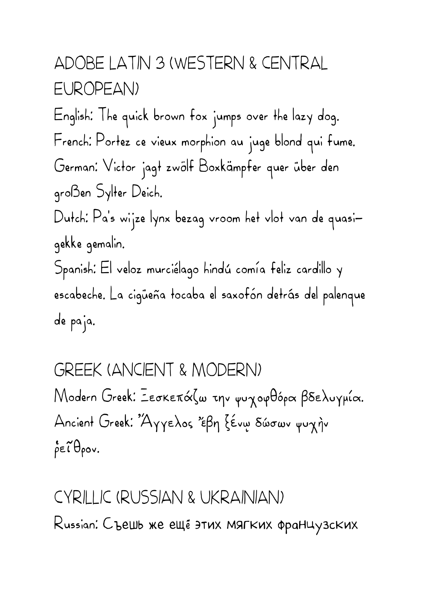
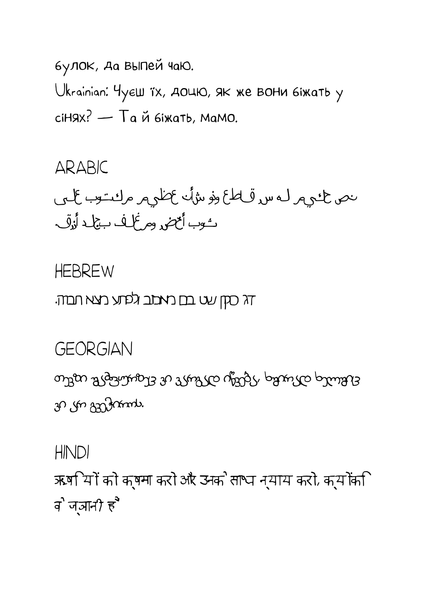
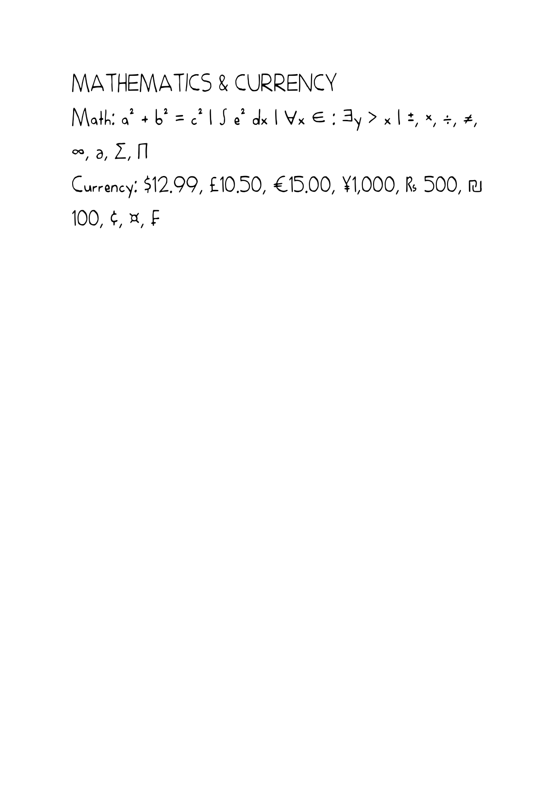

# Martin He - Type Designer
This repository contains the font families that I have created.

### Self-Created Font Families
All font families are free for personal use only, unless otherwise specified.

**N.B.** For commercial enquiries, please contact me directly at [martinhe.co.uk](https://martinhe.co.uk).

#### Aardvarki
My first foray into the world of type design, Aardvarki is a playful and versatile handwritten font family. Though it only contains support for basic Latin, and Greek with a few mathematical symbols, it is a fun and unique addition to any design project. It has since been superceded by *Royana*, which is essentially a more refined version of Aardvarki, but I still have a soft spot for this font family.

*Available in*: Regular, Italic, Bold, Light.

#### Maardings
Of pretty much zero practical use to anyone except me, this is a font family using my own secret alphabet system, hence the naming (similar to Wingdings). This is purely for fun, and something I created when I was about 8 years old.

*Available in*: Regular.

#### Royana
Downloaded over 10,000 times (across platforms, as of May 2026), Royana is my most popular font family to date. Used in commercial projects such as packaging for a Greek e-commmerce store; a Russian children's book publisher; or even a French Guyanan nature guide, Royana has the versatility to deliver for projects in Latin, Greek, Cyrillic, Hebrew, Hindi, and other scripts. It is a playful and friendly typeface, with a touch of elegance, making it suitable for a wide range of design projects. **Please note for commercial enquires (and a more complete character set, including different weights and styles), please contact me directly at [martinhe.co.uk](https://martinhe.co.uk), or on Instagram at [@martin.he543](https://www.instagram.com/martin.he543/).**

*Available in*: Regular, Condensed.

*Scripts/Languages supported*: Available in: Latin Extended (including English, French, German, Italian, Portuguese, Spanish, Norwegian, Dutch, Luxembourgish, and more), Ancient and Modern Greek, Cyrillic (including Russian and Ukrainian), Arabic, mathematical symbols, currency symbols, Hebrew, Georgian, and Hindi.

